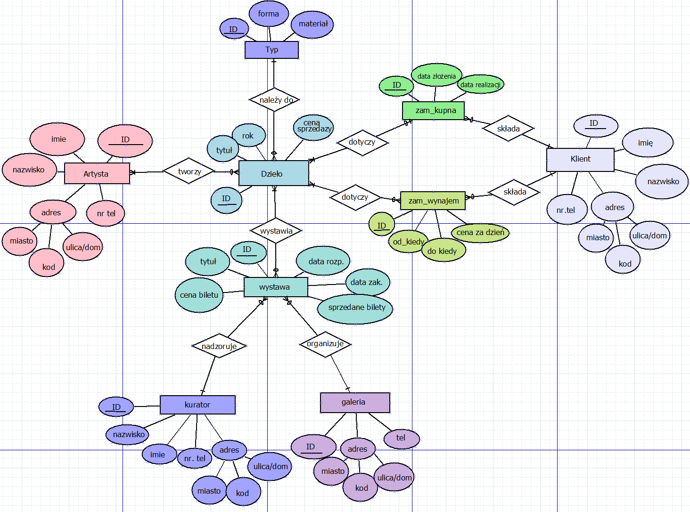

# Baza danych dla sieci galerii sztuki
Projekt ma na celu stworzenie bazy danych, która umożliwia zarządzanie informacjami o konkretnych galeriach, artystach, klientach, kuratorach, działach sztuki,  zamówieniami kupna, wynajmu oraz wystawach. Główny zamysł to zarządzanie zasobami, monitorowanie sprzedaży i pomoc w organizacji wystaw.

# Diagram ERD



# Encje i atrybuty:
* Artysta: nr, imie, nazwisko, miasto, kod_pocztowy, ulica_dom, nr_tel
* Klient: nr, imie, nazwisko, miasto, kod_pocztowy, ulica_dom, nr_tel
* Kurator: nr, imie, nazwisko, miasto, kod_pocztowy, ulica_dom, nr_tel
* Dzieło: nr, tytuł, typ, rok powstania, cena
* Galeria: nr, miasto, kod_pocztowy, ulica_dom, nr_tel
* Zamówienie kupna: nr, data złożenia zamówienia, data realizacji
* Zamówienie wynajmu: nr, data rozpoczęcia wynajmu, data zakończenia wynajmu
* Wystawa: nr, tytuł, data rozpoczęcia, data zakończenia, cena biletu, sprzedane bilety

# Charakter związków między encjami:
* Artysta – Dzieło: Relacja wiele-do-wielu (jeden artysta może stworzyć wiele dzieł, a jedno dzieło może być stworzone przez wielu artystów).
* Klient – Zamówienie kupna: Relacja jeden-do-wielu (jeden klient może złożyć wiele zamówień kupna).
* Klient – Zamówienie wynajem: Relacja jeden-do-wielu (jeden klient może złożyć wiele zamówień wynajmu).
* Zamówienie wynajem – Dzieło: Relacja wiele-do-wielu (jedno zamówienie wynajmu może się składać z wielu dzieł, jedno dzieło może być wynajmowane wiele razy).
* Zamówienie kupna – Dzieło: Relacja jeden-do-wielu (jedno zamówienie kupna może obejmować wiele dzieł, ale dzieło może być sprzedane tylko raz).
* Kurator - Wystawa: Relacja jeden-do-wielu (jeden kurator może być odpowiedzialny za wiele wystaw).
* Galeria - Wystawa: Relacja jeden-do-wielu (jedna galeria może organizować wiele wystaw).
* Dzieło – Wystawa: Relacja wiele-do-wielu (jedno dzieło może być wystawiane wiele razy, wystawa może eksponować wiele dzieł).

# Wyzwalacze:
*	Dwa wyzwalacze pilnujące, by przy próbie przypisania dzieła do wystawy/wynajmu daty nie pokrywały się z inną wystawą/wynajmem.
* Wyzwalacz zapobiegający próbie przypisania sprzedaży do dzieła, które nie ma ceny (czyli nie jest na sprzedaż).

# Przykładowe zapytania:
**Wyświetlanie dzieł danego autora**
```
SELECT d.nr, tytul
FROM (artysta a INNER JOIN artysta_dzielo ad ON a.nr = ad.nr_artysta)
INNER JOIN dzielo d ON d.nr = ad.nr_dzielo
WHERE A.nr = 1
ORDER BY d.tytul
```
**Jakie dzieła nigdy nie były wystawiane i nie są sprzedane?**
```
SELECT nr, tytul, typ
FROM dzielo
WHERE nr NOT IN (SELECT nr_dzielo FROM dziela_na_wystawie) AND sprzedaz_nr IS NULL
```
**Jakie dzieła są dostępne do sprzedaży?**
```
SELECT * FROM dzielo
WHERE sprzedaz_nr IS NULL AND cena IS NOT NULL
```
**Jaki jest zysk ze sprzedaży biletów na minionych wystawach?**
```
SELECT nr, tytuł, sprzedane_bilety * cena_biletu AS zysk
FROM wystawa
WHERE data_zak < CURRENT_DATE
```
**Jaki jest zysk ze sprzedaży biletów na wystawach według kuratorów odpowiadających za wystawę?**
```
SELECT kurator.nr, imie, nazwisko, SUM(cena_biletu * sprzedane_bilety) AS zysk_z_wystaw
FROM kurator, wystawa
WHERE kurator.nr = wystawa.nr_kurator AND wystawa.data_zak < CURRENT_DATE
GROUP BY kurator.nr
```

  


